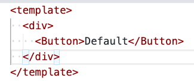
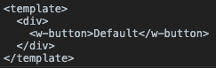
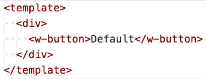
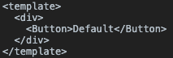

# water-loader
> 统一的 Water 标签编写规范

## 预览

可进入 `./demo/` 文件夹，安装以来之后，执行 `npm start` ，进行查看。

##### 若 `Button` 转译成 `w-button`

不需要加参数，效果如下

1. 转译前：

2. 转移后：

##### 若 `w-button` 转译成 `Button`

需要在 `./demo/webpack.config.js` 中加 `prefix: true` ，效果如下

1. 转译前：

2. 转移后：

